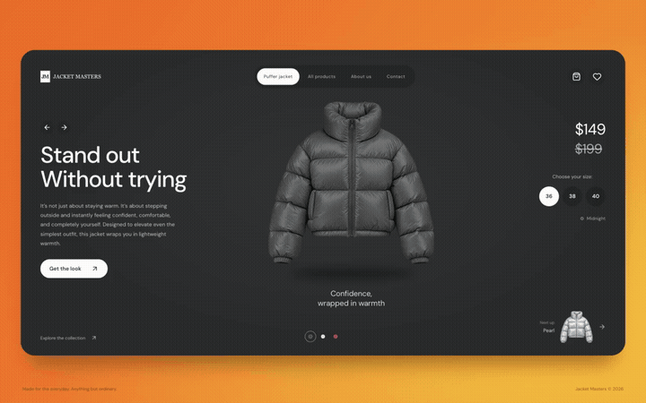

# Jacket Masters

A responsive puffer jacket storefront built with React, TypeScript, Vite, Tailwind CSS and Motion.

## Website showcase

A 22-second, 60 fps showcase of the jacket flying from the lower-right preview into the center. It cycles through Pearl, Cherry, and Midnight, then demonstrates right-clicking to go back and clicking to advance again.



[Watch or download the full-quality video](docs/media/showcase.mp4)

## Develop

```sh
npm install
npm run dev
```

## Validate

```sh
npm run build
npm run lint
```

Includes coordinated color transitions, reduced-motion support, accessible native dialogs, size selection, session favorites, and a shopping bag persisted locally. Checkout is intentionally unavailable in this UI prototype. Prices and product claims are illustrative.

## Assets and motion

`public/images/puffer.png` was generated with the built-in image-generation tool using this prompt:

> Photorealistic premium pearl silver puffer jacket cutout, straight-on front view, high padded collar, horizontal baffles, center zipper, hanging long sleeves, elastic cuffs, cropped waist. Detailed glossy nylon and stitching. Entire jacket on transparent background, no model, hanger, floor, shadow, text or logo. Softbox lighting; centered, filling 90% of square canvas.

Click the “Next up” jacket to advance a color. Right-click it (or press Left Arrow while it is focused) to return to the previous color. The arrow buttons also work on touch devices. Each transition measures the preview and hero positions so the flight follows the responsive layout, and reduced-motion mode uses a brief fade.

Dark and cherry variants use CSS color grading. Floating and transitions use CSS and Motion, not a 3D mesh. A GLB jacket model would be needed for genuine 360-degree viewing with React Three Fiber.

## Cloudflare hosting

Build command: `npm run build`. Output directory: `dist`. No server or environment secrets are required.

Compatible with Cloudflare Pages (connect this repo and use the settings above), or Cloudflare Workers static assets using the included `wrangler.jsonc`. After a build, `npx wrangler deploy` deploys the static assets when you are ready and authenticated. The chosen custom subdomain under `kostyakazmiruk.com` can be added in Cloudflare after deployment. No domain or production deployment has been configured yet.

Typeface: DM Sans from Google Fonts. Jacket art is stored locally.
